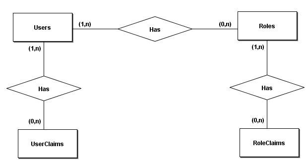

# ASP.NET Core Web API Lab

Read this documentation in other languages: [Portuguese (pt-BR)](README-pt-BR.md)

Application created with the main objective of exploring the features and characteristics of the ASP.NET Core Web API.

In this application, several real usage scenarios were tested based on a mini application.

After the case studies, the main conclusions were documented in this file and serve as a reference for use and source of consultation.

## Table of contents

* [Prerequisites](#prerequisites)
* [Getting Started](#getting-started)
* [Solution Structure](#solution-structure)
    * [Used Packages](#used-packages)
    * [AspNetCoreWebApiLab-Api](#AspNetCoreWebApiLab-Api)
    * [AspNetCoreWebApiLab-ApiClient](#AspNetCoreWebApiLab-ApiClient)
    * [AspNetCoreWebApiLab-Persistence](#AspNetCoreWebApiLab-Persistence)
* [Rest X Restful](#rest-x-restful)
    * [Maturity Model](#maturity-model)
    * [Resources](#resources)
    * [HTTP Verbs](#http-verbs)
    * [Hypermedia (HATEOAS)](#hypermedia-HATEOAS)
* [Versioning](#versioning)
* [ASP.NET Core Identity API](#aspnet-core-identity-api)
    * [API First](#api-first)
    * [OpenAPI Specification](#openAPI-specification)
    * [ApiExplorer](#apiexplorer)
* [Error handling and validation](#error-handling-and-validation)
* [Security](#security)
    * [Authentication](#authentication)
    * [JWT and Swagger](#jwt-and-swagger)
    * [Authorization](#authorization)

## Prerequisites

What needs to be installed on the machine to extend and debug the project:

    Visual Studio Community 2019;
    Net Core SDK 3.1;
    SQL Server

## Getting Started

* Install and/or configure all the prerequisites mentioned above;
* Clone the repository on the local machine;
* Create the database used in the application: AspNetCoreWebApiLab;
* Download Nuget dependencies for the solution in Visual Studio;
* Run the migrations to the desired database with the command: Update-Database -Context [ClassName of context];
* Execute the AspNetCoreWebApiLab.Api project;

## Solution Structure

The solution `AspNetCoreWebApiLab` is divided into three projects: `AspNetCoreWebApiLab.Api`, `AspNetCoreWebApiLab.ApiClient` and `AspNetCoreWebApiLab.Persistence`. In the next sections the projects are detailed.

### Used Packages

>Net Core 3.1

>[VisualStudio Web CodeGeneration Design 3.1.5](https://www.nuget.org/packages/Microsoft.VisualStudio.Web.CodeGeneration.Design/3.1.5)

>[Microsoft.AspNetCore.Mvc.Versioning 4.2.0](https://www.nuget.org/packages/Microsoft.AspNetCore.Mvc.Versioning/4.2.0)

>[Swashbuckle.AspNetCore 5.6.3](https://www.nuget.org/packages/Swashbuckle.AspNetCore/5.6.3)

### AspNetCoreWebApiLab-Api

### AspNetCoreWebApiLab-ApiClient

### AspNetCoreWebApiLab-Persistence

## Rest X Restful

Representational state transfer (REST) is a standard defined by Roy Fielding for a software architecture of interactive applications that use Web services. A Web service that follows this standard is called RESTful. [Wikipedia]

### Maturity Model

A [model](https://martinfowler.com/articles/richardsonMaturityModel.html) developed by Leonard Richardson that breaks down the principal elements of a REST approach into three steps: resources, http verbs, and hypermedia controls.

### Resources

Usually, a resource is something that can be stored on a computer and represented as a stream of bits: a document, a row in a database, or the result of running an algorithm. 

So now rather than making all our requests to a singular service endpoint, we now start talking to individual resources. Examples of resources: customers, companies, clients and users. Many APIs design guides recommends **the use of nouns in plural** to name resources instead verbs.

### HTTP Verbs

Separate URIs are given for separate resources, while incorporating different HTTP verbs according to the CRUD usage of those resources. The mainly HTTP verbs are: POST, GET, PUT, PATCH and DELETE

| HTTP Verb | Action on resource |
|:---------:|:------------------:|
| POST      | Create             |
| GET       | Read               |
| PUT       | Update             |
| PATCH     | Partial Update     |
| DELETE    | Delete             |

The mainly response status codes are listed below. These status codes represents the behavior that occurred on the server.

| Code | Description          | 
|:----:|:---------------------|
| 200  | OK                   |
| 201  | Created              |
| 400  | Bad Request          |
| 401  | Not Authorized       |
| 403  | Forbidden            |
| 404  | Not Found            |
| 422  | Unprocessable Entity |
| 500  | Internal Error       |

For a good use of HTTP verbs with correct status codes the table below has been made. It's very important to make the correct use of verbs and codes to correctly use the REST standard.

| HTTP Verb | Related status codes              |
|:---------:|:----------------------------------|
| POST      | 201, 400, 401, 403, 422, 500      |
| GET       | 200, 400, 401, 403, 404, 500      |
| PUT       | 200, 400, 401, 403, 404, 422, 500 |
| PATCH     | 200, 400, 401, 403, 404, 500      |
| DELETE    | 200, 400, 401, 403, 404, 500      |

This [controller](./AspNetCoreWebApiLab.Api/Controllers/Experiments/ResourcesController.cs) presents how to implements a basic resource that uses the main HTTP verbs with correct response status codes. 

### Hypermedia (HATEOAS)

HATEOAS (Hypermedia as the Engine of Application State) is a constraint of the REST application architecture. The term “hypermedia” refers to any content that contains links to other forms of media such as images, movies, and text.

REST architectural style lets us use the hypermedia links in the response contents. It allows the client can dynamically navigate to the appropriate resources by traversing the hypermedia links. Below is shown an example:

``` JSON
HTTP/1.1 200 OK
Content-Type: application/vnd.acme.account+json
Content-Length: ...

{
    "account": {
        "account_number": 12345,
        "balance": {
            "currency": "usd",
            "value": -25.00
        },
        "links": {
            "deposit": "/accounts/12345/deposit"
        }
    }
}
```

## Versioning

One of the most important things in API design is versioning. The business rules changes and the api users shouldn't identify issues.

The **main types of versioning** in API design are: **query parameters, custom header and URI path**.

With ASP.NET Core Web API is possible to version the controller or controller actions. For this is used the `ApiVersion`, `MapToApiVersion` attributes and the [Microsoft.AspNetCore.Mvc.Versioning](https://www.nuget.org/packages/Microsoft.AspNetCore.Mvc.Versioning) package should be added on solution.

To enables versioning with the Microsoft package the code below should be added on [Startup](./AspNetCoreWebApiLab.Api/Startup.cs) class in the API project.

``` C#
services.AddApiVersioning();
```

The controllers [VersioningController](./AspNetCoreWebApiLab.Api/Controllers/Experiments/VersioningController.cs) and [Versioning20Controller](./AspNetCoreWebApiLab.Api/Controllers/Experiments/Versioning20Controller.cs) showns examples of **a API that has three versions: 1.0, 1.1 and 2.0**.

The versions 1.0 and 1.1 are in the same controller, however the version 2.0 is in the other controller. The api versioning type can be defined on startup configuration using the `ApiVersionReader` option like the examples below:

* Query parameters

``` C#
services.AddApiVersioning(versioningOptions => 
{
    versioningOptions.ApiVersionReader = new QueryStringApiVersionReader();
});
```

* Custom header

``` C#
services.AddApiVersioning(versioningOptions => 
{
    versioningOptions.ApiVersionReader = new HeaderApiVersionReader("X-Version");
});
```

* URI path

The parameter `{version:apiVersion}` must be inserted into the controller route. 

``` C#
services.AddApiVersioning(versioningOptions => 
{
    versioningOptions.ApiVersionReader = new UrlSegmentApiVersionReader();
});
```

To use many configurations the `Combine` method must be used for merge two or more configurations:

``` C#
services.AddApiVersioning(versioningOptions => 
{
    versioningOptions.ApiVersionReader = ApiVersionReader.Combine(new QueryStringApiVersionReader(),
                                                                  new HeaderApiVersionReader("X-Version"),
                                                                  new UrlSegmentApiVersionReader());
});
```

The controllers [VersioningController](./AspNetCoreWebApiLab.Api/Controllers/Experiments/VersioningController.cs) and [Versioning20Controller](./AspNetCoreWebApiLab.Api/Controllers/Experiments/Versioning20Controller.cs) use all three types of versioning: query parameters, custom header and URI path. For more details the [Startup](./AspNetCoreWebApiLab.Api/Startup.cs) class can be consulted.

## ASP.NET Core Identity API

To exemplify the use of ASP.NET Core Web API some services of ASP.NET Core Identity have been used through API, more specifically the Users, Roles and Claims services.

The image below exemplifies the relationship and dependency between the Users, Roles and Claims entities:



* A User can have one or more Roles associated;
* A User can have one or more Claims associated;
* A Role can have one or more Claims associated;

More details about the purpose of Roles and Claims in ASP.NET Core Identity are shown [here](https://github.com/stenionobres/AspNetCoreIdentityLab#claims).

### API First

An [API-first](https://swagger.io/resources/articles/adopting-an-api-first-approach/) approach means that for any given development project, your APIs will be developed in the first place. An API-first approach involves developing APIs that are consistent and reusable, which can be accomplished by using an API description language to establish a contract for how the API is supposed to behave.

Establishing a contract involves spending more time thinking about the design of an API. It also often involves additional planning and collaboration with the stakeholders providing feedback on the design of an API before any code is written.

The Benefits of an API-First Approach are:

* Development teams can work in parallel;
* Reduces the cost of developing apps;
* Increases the speed to market;
* Ensures good developer experiences;
* Reduces the risk of failure;

### OpenAPI Specification

The OpenAPI Specification, originally known as the Swagger Specification, is a specification for machine-readable interface files for describing, producing, consuming, and visualizing RESTful web services.

OpenAPI Specification is in version 3.0 and for generate this specification the package [Swashbuckle.AspNetCore](https://www.nuget.org/packages/Swashbuckle.AspNetCore) was added on the project.

The configuration of Swashbuckle.AspNetCore is defined on [Startup](./AspNetCoreWebApiLab.Api/Startup.cs) class.

### ApiExplorer

ApiExplorer is an abstraction on top of ASP.NET Core MVC that exposes metadata about that application. Swashbuckle.AspNetCore uses the metadata ApiExplorer exposes to generate an OpenApi specification. This specification is generate on `swagger.json` file.

Consumers of the API have to know what types of responses they can expect so they can act accordingly. Thinking on that the attributes `Consumes`, `Produces` and `ProducesResponseType` should be used to improve the specification generated.

``` C#
[ApiController]
[Route("api/users")]
[Consumes("application/json")]
[Produces("application/json")]
public class UsersController : ControllerBase
{
    [HttpGet("{userId}")]
    [ProducesResponseType(StatusCodes.Status200OK, Type = typeof(UserModel))]
    [ProducesResponseType(StatusCodes.Status400BadRequest)]
    [ProducesResponseType(StatusCodes.Status404NotFound)]
    [ProducesResponseType(StatusCodes.Status500InternalServerError)]
    public ActionResult GetUsers(int userId)
    {
        try
        {
            return Ok();
        }
        catch (System.Exception)
        {
            return StatusCode(StatusCodes.Status500InternalServerError, "A server error has occurred");
        }
    }

}
```

## Error handling and validation

One the most important requirements of an API is data validation with the purpose of maintain the data integrity.

The status codes used when data is inconsistent are **400 - Bad Request** and **422 - Unprocessable Entity**. By default the ASP.NET Core Web API uses the 400 status, however a configuration on [Startup](./AspNetCoreWebApiLab.Api/Startup.cs) class using `InvalidModelStateResponseFactory` attribute of ApiBehaviorOptions was made to use 422 status. 

The strategies that can be used for validation are listed below:

* Data annotations

These are attributes that apply predefined rules on api models. The [UserModel](./AspNetCoreWebApiLab.Api/Models/V1/UserModel.cs) class has some examples of DataAnnotations;

* IValidatableObject interface

The `IValidatableObject` interface provides a way to create a custom validation inside model class. The [UserModel](./AspNetCoreWebApiLab.Api/Models/V1/UserModel.cs) class has an example of IValidatableObject interface;

* Custom validation attribute

Another option to validate data is to create a custom validation attribute. An example is shown below:

``` C#
public class DotComDomainAttribute : ValidationAttribute
{
    public override bool IsValid(object value)
    {
        var inputValue = value as string;

        return !string.IsNullOrEmpty(inputValue) && inputValue.Contains(".com");
    }
}

public class Model
{
    [DotComDomain(ErrorMessage = "Only .com domains are allowed.")]
    public string Domain { get; set; }
}
```

* Fluent Validation

[Fluent Validation](https://github.com/FluentValidation/FluentValidation) is a small validation library for .NET that uses a fluent interface and lambda expressions for building validation rules.

If you need apply more complex rules the Fluent Validation library can be a good choice.

## Security

One the most important non-functional requirements of an API is security. Basically API Security is responsible to maintain data integrity and create access levels on endpoints.

### Authentication

Authentication is a process that answer the question, **Who are you in the application?** A good choice for api authentication is [JWT (Json Web Token)](https://github.com/stenionobres/AspNetCoreIdentityLab#json-web-token-jwt). A similar configuration for JWT was defined in this project.

### JWT and Swagger

For use JWT authentication token with Swagger is necessary to configure some security definitions on [Startup](./AspNetCoreWebApiLab.Api/Startup.cs) class. Below are listed the method names that configures JWT Security with Swagger:

``` C#
swaggerOptions.AddSecurityDefinition("jwtAuth", GetOpenApiSecurityDefinition());
swaggerOptions.AddSecurityRequirement(GetOpenApiSecurityRequirement());
```

### Authorization

Authorization is a process that answer the question, **What can you do in the application?** The use of `[Authorize]` attribute allows to restrict wich actions the user of API can do.

Some roles was defined with Authorize attribute and [JwtService](./AspNetCoreWebApiLab.Api/Services/JwtService.cs) uses that roles to make the access token, so only tokens with that roles can request the endpoints. More details about how authorization works on ASP.NET Core can be accessed [here](https://github.com/stenionobres/AspNetCoreIdentityLab#authorizing-a-user).